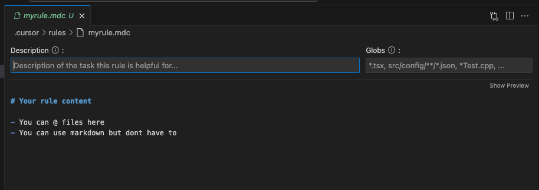
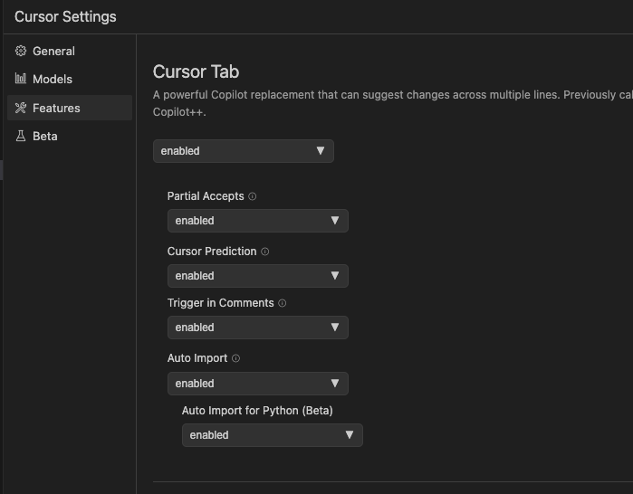
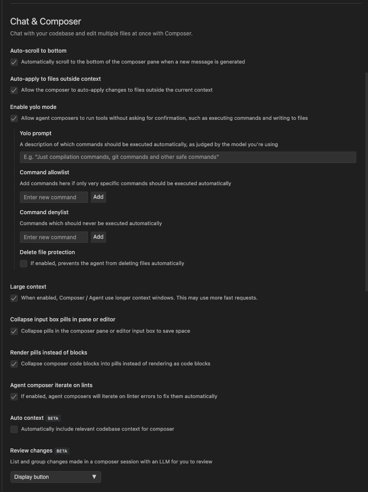
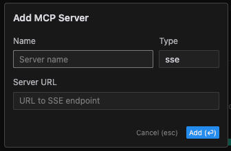
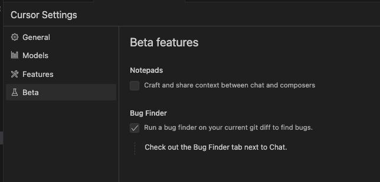
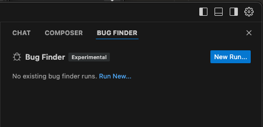

# 📕 第4章 Cursor のカスタマイズ設定

原稿を書き上げた後の変更点について補足説明します。

## 📘 4.1 General

### 📗 Project Rules

- .cursor/rules ディレクトリに、リポジトリレベルのルールを複数作成できる機能です。
- AIエージェントが自動的に適切なルールを選択して従います。
- プロジェクトのコードベースと同期される仕組みになっています。

1. 「+ Add new rule」ボタンで新規作成。  
       

2. ルールのファイル名を指定。  
       

3. ルールの内容を記述：説明文 (タスクの目的や用途、@でファイル参照を指定可能)、Globs (ファイルパスのパターン)  
    

## 📘 4.3 Features 

### 📗 Cursor Tab

Copilot++ は Cursor Tab という呼称に変わりました。

- enabled / disabled：Cursor Tab の有効、無効を切り替えます。
- Partial Accepts：editor.action.inlineSuggest.acceptNextWordキーバインド（初期値→）を使用して、提案された次の単語を受け入れることができます。
- Cursor Prediction：Cursor Tab の提案を受け入れた後に移動する次の行を予測し、タブで受け入れることができます。
- Trigger in Comments：コメントで Cursor Tab の提案を有効または無効にする。
- Auto Import：Cursor Tab で必要なモジュールをインポートする（TypeScript）。
- Auto Import for Python （Beta）：Cursor Tab で必要なモジュールをインポートする（Python）。

### 📗 Chat & Composer

- Auto-scroll to bottom：自動スクロール（新しいメッセージが生成された際、コンポーザーペインを自動的に最下部までスクロールします）
- Auto-apply to files outside context：コンテキスト外のファイルへの自動適用（コンポーザーによる変更を、現在のコンテキスト外のファイルにも自動適用することを許可します）
- Enable yolo mode：Yoloは「You Only Live Once」（人生は一度きり）の略語で、「ヨーロー」と発音します。ここでは、エージェントが自動的にターミナルコマンドを実行する機能を意味します。Composer agent モードで、エージェントが自動的にターミナルコマンドを実行する機能が有効になります。
- Yolo prompt：エージェントが自動的にターミナルコマンドを実行するためのプロンプトを指定します。
- Command allowlist：エージェントによる実行を許可するコマンドを指定します。
- Command denylist：エージェントによる実行を拒否するコマンドを指定します。
- Delete file protection：ファイルの自動削除を防止します。
- Large context：Composer agent がより長いコンテキストウィンドウを使用できる設定（より多くの高速リクエストを使用する可能性あり）
- Collapse input box pills in pane or editor：ペインまたはエディタの入力ボックスのピルを折りたたむ（スペースを節約するため、コンポーザーペインまたはエディタ入力ボックスのピルを折りたたみます）
- Render pills instead of blocks：ブロックの代わりにピルを表示（コンポーザーのコードブロックをコードブロックとして表示せず、ピルとして折りたたみます）
- Agent composer iterate on lints：lintエラーがある場合、コンポーザーは修正を再試行します。
- Auto context (BETA)：コンテキストを自動的に更新します。
- Review changes (BETA)：Composer agent の変更を確認します。での変更をLLMを使用してリストアップし、グループ化してレビューする機能です。
    1. Display button：ボタンを表示します。
    2. Auto-run：自動実行します。
    3. Disabled：無効にします。

### 📗 MCP (Model Context Protocol)

バージョン 0.45.6 から MCP の設定が追加されました（MCP は Model Context Protocol の略で、Cursor のモデルにコンテキストを提供するプロトコルです）。
※ Composer の agent モードのみで対応しています。

1. 「Add new MCP server」ボタンでクリック。

2. サーバー名、タイプ、URLを指定。

3. 「Add」ボタンでサーバーの設定を保存。

MCPの説明や、MCPの設定方法については、[Cursor のModel Context Protocol 設定ドキュメント](https://docs.cursor.com/advanced/model-context-protocol)をご覧ください。

### 📗 Docs

カスタム Docs のリスト内に再インデックスを行うボタン（回る矢印アイコン）が追加されました。実行すると、ドキュメントの最新情報にアクセスして、新しい情報のインデックスを構築します。

また、インデックスされた日付、時刻も表示されるようになりました。

## 📘 4.4 Beta

- Notepads：Notepadsを有効にします（機能については第6章にて説明します）。
- Bug Finder：不具合検出機能を有効にします。

### Interpreter Mode (BETA)

本書で何度かご紹介した Interpreter Mode は、0.40 からチャットモードのプルダウンで表示されなくなりました。

- Interpreter Mode はより強化された機能として、Composer の agent モードが実装されました。以降の章で、Interpreter Mode を使用している場面では、Composer agent をお使いください。Composer agent については、[第6章](../chapter6/README.md)の説明をご覧ください。

## 📘 4.5 Help

Help 機能は廃止されました。
使い方を質問する専用のチャットはなくなりましたが、AIペインの Normal Chat に質問することで使用方法についても回答を得られる場合があります。他に情報が見つからない時に有益な情報源ですが、この点はハルシネーションが多めで、回答をそのまま信じるのではなく、回答にもとづいて手元の動作で検証を行うことが大切です。
