# 📕 第6章 Cursor 開発テクニック

## 📘 追補 Composer

### Composer Notepads

0.41 で Composer のコントロールパネルに「Composer Notepads」機能が追加されました（0.40 で Projects と呼ばれていた機能を置き換えるものです）。

「Notepads」を作ると、そのプロジェクトに属する複数の Composer 間、さらには CHAT 間まで、参照ファイルやプロンプト履歴の内容を共有することができます。

操作は、以下の手順となります。

1. コントロールパネル左下の「Create New」ボタンをクリックします。

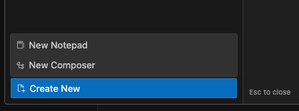

2. ポップアップされた選択肢から「New Notepad」をクリックします。
（または、コントロールパネル左上「Notepads」欄の右端にある＋アイコンをクリックします）

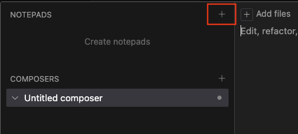

3. Notepads のタイトルを入力して、「Creat」ボタンをクリックします。

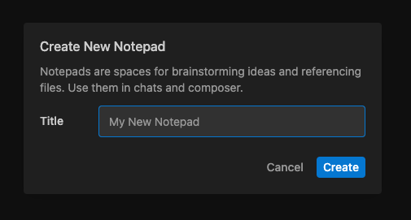

3. プロジェクト画面中央の「Type your thoughts, use @ to mention files」欄にプロジェクトの考え、参照したいファイルを @ 記号の指定で入力します。

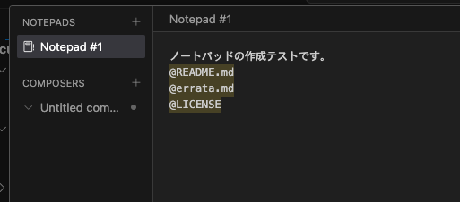

4. Notepads 画面右下の「Add context」の＋ボタンからファイルピッカーを呼び出して、参照ファイルを登録できます。

5. Notepads 画面の右上にある「Use in Composer」ボタンをクリックすると、Notepads を参照する Composer が表示されます。

6. Notepads 画面の右上にある「Use in AI chat」ボタンをクリックすると、Notepads を参照する CHAT が表示されます。

  
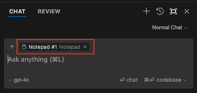

----

- Notepads はチャットや Composerから @ によるシンボル参照も可能です。以下のスクリーンショットは指定の手順と結果の画面です。

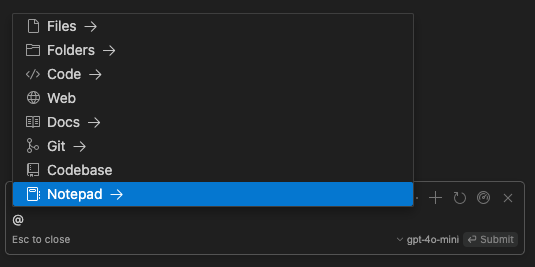

 

----

### Composer の AI ペイン内表示

Composer を AI ペイン内に表示することができるようになりました。
Composer 内のメニュー操作か、⌘+D、または Ctrl++D ショートカットで切り替えることができます。

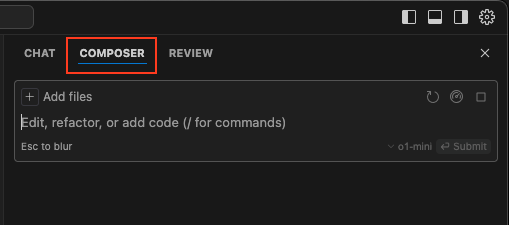

好みで AI ペイン内の表示位置を変更することもできます（項目名をドラック）。

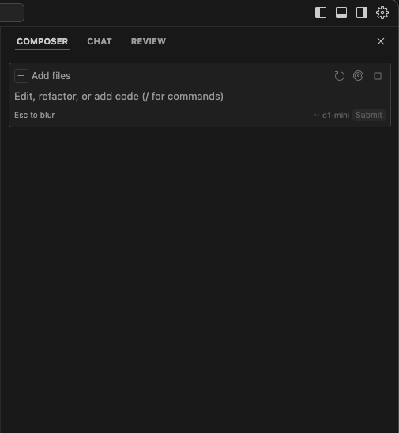

AI ペイン内の Composer は、基本的な操作方法は従来と変わりませんが、プロンプト欄が下部に固定される点が特徴です。多くのユーザーが横長のモニター環境を使用していることを考慮すると、左側に表示位置を固定することで、チャットのやり取りをより長く、効率的に確認できるという大きな利点があります。また、表示位置を変更しても、ファイルやフォルダの作成などの Composer の核心的な機能は全て維持されます。この新しい表示オプションにより、ユーザーはより柔軟かつ効果的に Composer を活用できるようになりました。

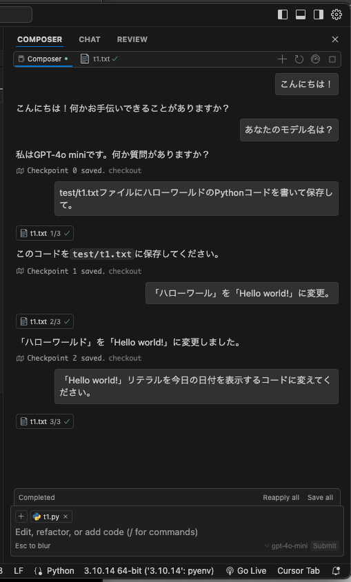

----

### Composer コントロールパネルのウィンドウ化

設定の Bate タブ内の「WINDOW CONTROLPANELIBETA）」を有効（enabled）にすると、Composer コントロールパネルを独立したウィンドウとして表示することができるようになりました。

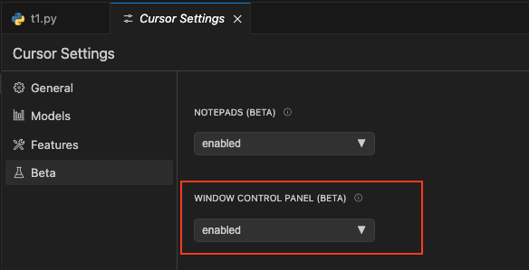

コントロールパネル右上にある「Open in new window」ボタンをクリックします。

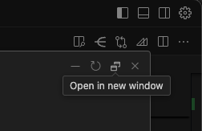

Composer コントロールパネルが独立したウィンドウとして表示された状態の例です。

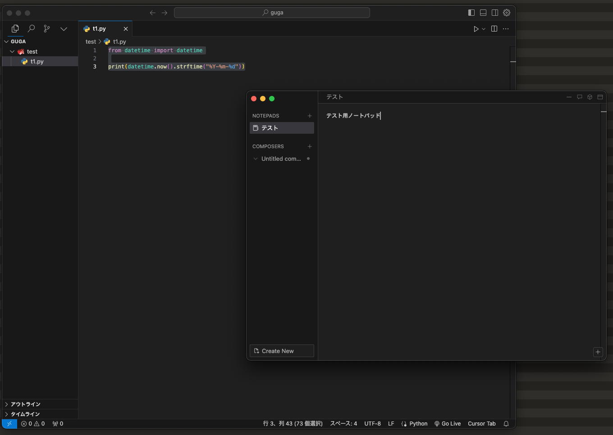

従来は、ほぼ全画面を覆うモーダルウィンドウであったため、エディター画面や過去のチャット履歴を参照しながらの操作ができない不便さがありましたが、操作性が大きく改善されました。

----

### 0.41 その他の変更点

- Composer とチャットが複数の画像を添付したプロンプトに対応しました。
- Composer の「Diff vlew」画面でコードの編集が可能になりました。
- Composer を Esc キーで閉じることができます（Composer が選択されていない時は、⌘+i、または Ctrl+i キーで選択し直してから実行）。

----

驚くべき速度で進化を続ける Cursor。著者はサンフランシスコで開催された Cursor User Meetup（2024/7/16）に参加しましたが、Anysphere 開発陣はユーザのニーズに非常に敏感です。会う人、会う人に「Composerはどう？」、「何を改善して欲しい？」と質問を受けました。日本の Cursor ユーザの皆様も、公式フォーラムなどを通してニーズ情報を伝えて、より良い Cursor を作るコミュニティの一員になりましょう。

- [Cursor Community Forum - The official forum to discuss Cursor.](https://forum.cursor.com/)
